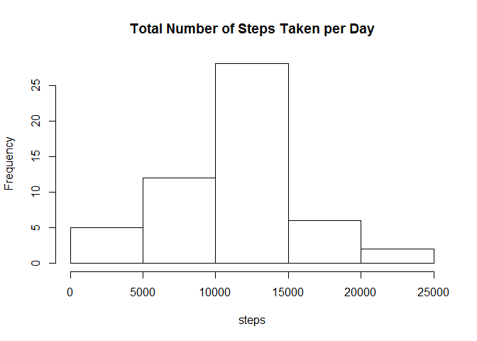
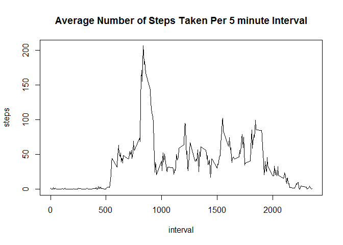
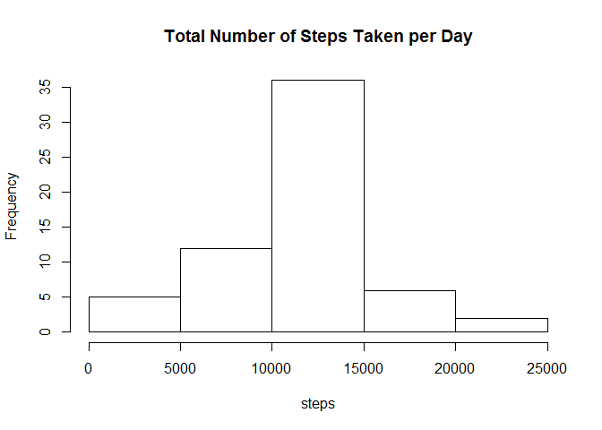
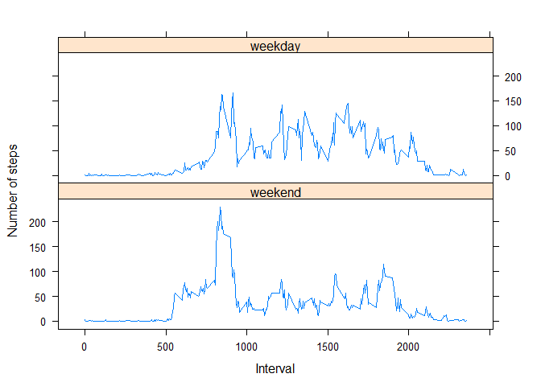

# Reproducible Research: Peer Assessment 1


```r
######################################
## Loading and preprocessing the data
######################################

library(lattice)

activityDataOrig <- read.csv("activity.csv",na.strings="NA")

## convert date from factor to Date type
activityDataOrig$date <- as.Date(as.character(activityDataOrig$date))


## create data frame without NA values
activityData <- activityDataOrig[ !is.na(activityDataOrig$steps),]

####################################################
## What is mean total number of steps taken per day?
####################################################

## group by date and sum the steps to calculate the total number of steps taken per day
activitySumPerDay <- aggregate(activityData$steps, by=list(activityData$date), FUN=sum)

## compute mean and median
meanOfSum <- mean(activitySumPerDay$x)
medianOfSum <- median(activitySumPerDay$x)

## plot histogram of the total steps per day
hist(activitySumPerDay$x, xlab="steps", main="Total Number of Steps Taken per Day")
```



```r
print(sprintf("The mean of the total number of steps per day is %s",mean(activitySumPerDay$x)))
```

```
## [1] "The mean of the total number of steps per day is 10766.1886792453"
```

```r
print(sprintf("The median of the total number of steps per day is %s", median(activitySumPerDay$x)))
```

```
## [1] "The median of the total number of steps per day is 10765"
```

```r
###############################################
## What is the average daily activity pattern?
###############################################

## group by interval and take the mean of each group (number of steps)
meanStepsByInterval <- aggregate(activityData$steps, by=list(activityData$interval), FUN="mean")

with(meanStepsByInterval, plot(Group.1, x, type="l", xlab="interval", ylab="steps", main="Average Number of Steps Taken Per 5 minute Interval"))
```



```r
maxInterval <- subset(meanStepsByInterval, x == max(meanStepsByInterval$x))

print(sprintf("The 5-minute interval which contains the maximum number of steps is %s",maxInterval$Group.1))
```

```
## [1] "The 5-minute interval which contains the maximum number of steps is 835"
```

```r
##########################
## Imputing missing values
##########################

## we need NAs in the data set for this question
numNA <- sum(is.na(activityDataOrig$steps))

print(sprintf("The total number of missing values in the dataset is %s",numNA))
```

```
## [1] "The total number of missing values in the dataset is 2304"
```

```r
print("Our strategy for replacing NA values will be to use the average step per 5-minute interval")
```

```
## [1] "Our strategy for replacing NA values will be to use the average step per 5-minute interval"
```

```r
## merge activityData with average steps per interval data frame so we can replace NAs
newActivityData <- merge(activityDataOrig, meanStepsByInterval, by.x = "interval", by.y = "Group.1")

## replace NAs with average step per interval
naIndices <- is.na(newActivityData$steps)
newActivityData[ naIndices, ]$steps <- newActivityData[ naIndices, ]$x


newActivitySumPerDay <- aggregate(newActivityData$steps, by=list(newActivityData$date), FUN=sum)

hist(newActivitySumPerDay$x, xlab="steps", main="Total Number of Steps Taken per Day")
```



```r
print(sprintf("The mean of the total number of steps per day without NA values is %s",mean(newActivitySumPerDay$x)))
```

```
## [1] "The mean of the total number of steps per day without NA values is 10766.1886792453"
```

```r
print(sprintf("The median of the total number of steps per day without NA values is %s", median(newActivitySumPerDay$x)))
```

```
## [1] "The median of the total number of steps per day without NA values is 10766.1886792453"
```

```r
print("The mean should not change but the median will differ from the value computed in part 1.")
```

```
## [1] "The mean should not change but the median will differ from the value computed in part 1."
```

```r
print("By replacing the NA values with a mean value, the mean should not change and the median should get closer to the mean")
```

```
## [1] "By replacing the NA values with a mean value, the mean should not change and the median should get closer to the mean"
```

```r
############################################################################
## Are there differences in activity patterns between weekdays and weekends?
############################################################################

## add weekend factor
newActivityData$isWeekend <- grepl("Saturday|Sunday",weekdays(newActivityData$date))
newActivityData$weekend <- factor(newActivityData$isWeekend,labels = c("weekend","weekday"))

## group by interval, weekend/weekday and average the groups (steps)
newMeanStepsByInterval <- aggregate(newActivityData$steps, by=list(newActivityData$interval, newActivityData$weekend), FUN="mean")

## plot lattice panel plot
with(newMeanStepsByInterval, xyplot(x ~ Group.1 | Group.2, type = "l", layout = c(1,2), xlab="Interval", ylab = "Number of steps"))
```


